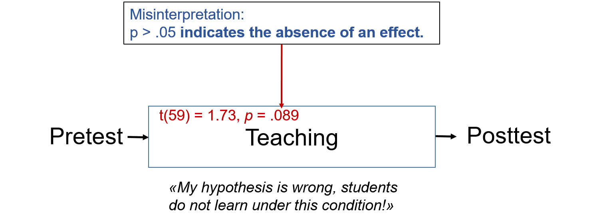
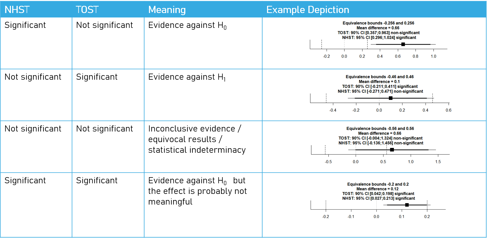
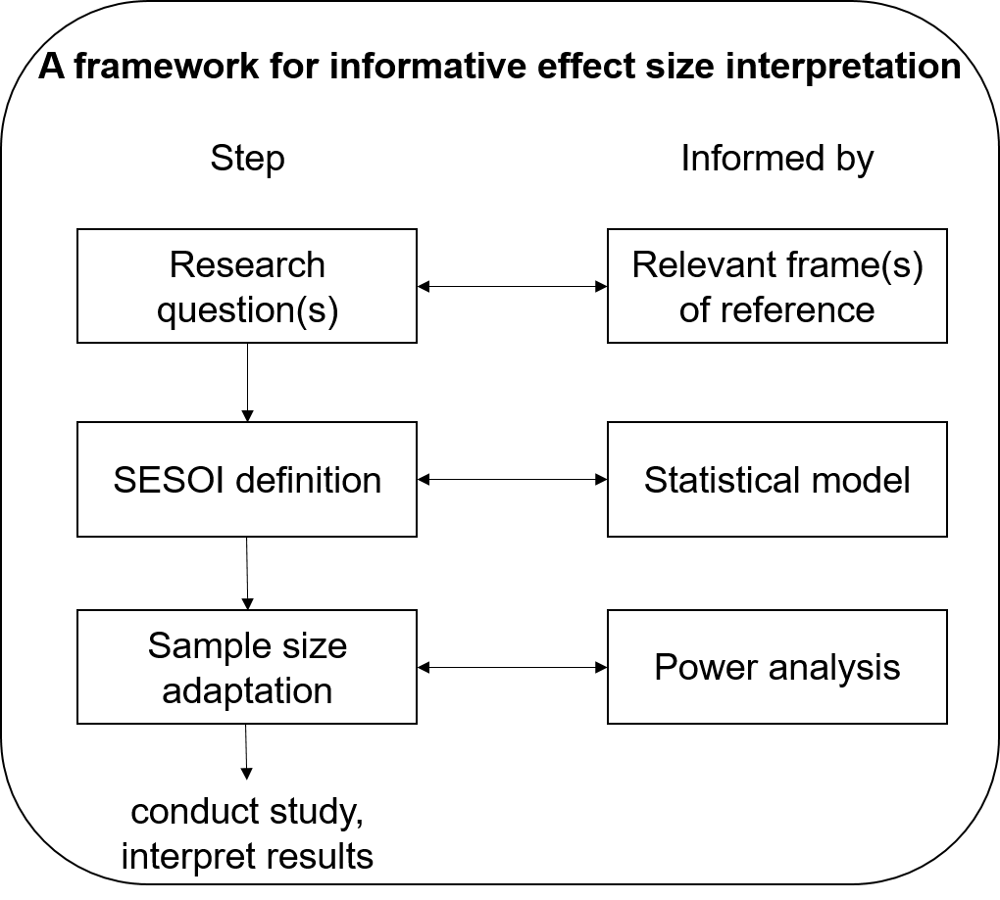
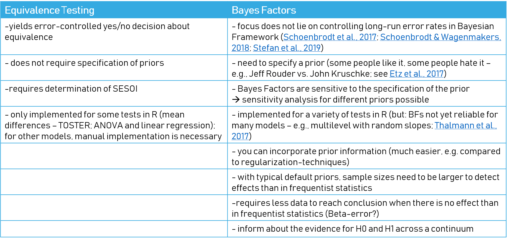

```{r setup, include=FALSE}
library(learnr)
library(sortable)# for ranking questions
library(emo) #for emojis #devtools::install_github("hadley/emo") #unfortunately not possible!
# so far, I wanted to integrate emo::ji("balance_scale"), emo::ji("coder"), emo::ji("teacher"),
# emo::ji("x"), emo::ji("research"), `emo::ji("crystal_ball")`, emo::ji("direct hit")
library(TOSTER)
library(psych)
library(BayesFactor)
library(BEST)
library(DescTools)
library(equivalencetests) #To be installed via devtools, slightly complicated:
#install.packages("devtools")
#devtools::install_github('cribbie/equivalencetests') #if installation fails, install dependencies separately
knitr::opts_chunk$set(echo = FALSE)
```

## Welcome!
#### What is this?
This is a partly interactive tutorial on equivalence testing, written with the [`learnr` package](https://rstudio.github.io/learnr). Equivalence testing is a set of procedures to directly test for the Null-hypothesis and reject the Alternative hypothesis.

This document accompanies the article "Equivalence Testing in Eight Easy Steps: an Annotated Tutorial" by Thurn & Edelsbrunner (2021) published in Psychological Methods [link](...) but you can use it without knowing the article.

This document is structured in an introductory part on equivalence testing and why we need it, an overview of several methods and ways to perform equivalence tests as well as a section on advanced aspects such as doing power analyses and choosing the relevant frames of reference.


#### Requirements
This tutorial is an introduction into equivalence testing. It starts with an extensive explanation of *p*-values, but we assume, that you are familiar with basic terms from frequentist statistics such as *variance*, *standard deviation*, *t-test*, *null-hypothesis*...
From time to time, you will encounter small quizzes and exercises with R code. You do not necessarily need prior knowledge in R to learn equivalence testing with this course (you can skip the exercises), but it is helpful to learn how to apply them yourself in R. If you want to use the R code from this tutorial locally, we recommend to install the following packages:

- `psych` 
- `DescTools`
- `TOSTER`
- `BEST`
- `BayesFactor`
- `equivalencetests`

Whereas the first five packages should be relatively easy to install, the `equivalencetests` package by Robert Cribbie is not on CRAN yet and needs to be installed via `devtools`, which is slightly more complicated:
```{r, eval=FALSE, echo=TRUE}
install.packages("devtools")
devtools::install_github('cribbie/equivalencetests') #if installation fails, try to install dependencies separately
```

All your work in the tutorials will be presaved and automatically restored when you revisit this site, unless you click the `Start Over` button on the left.

#### About the Authors
[Christian Thurn](https://gess.ethz.ch/en/the-department/people/person-detail.MjE4NTQx.TGlzdC81MTIsNjE4MTIwODY=.html) is a PhD student in learning and instruction at ETH Zurich. He does research on science education and network analysis and is an enthusiastic R user.

[Peter Edelsbrunner](https://ethz.ch/content/specialinterest/gess/ifv/professur-fuer-lehr-und-lernforschung/de/ueber-uns/personen/person-detail.html?batch_name=publications&page=0&persid=191462), is a postdoc in learning and instruction at ETH Zurich. He investigates scientific thinking throughout the lifespan, likes to do mixture modeling and examines statistical practices in educational and developmental research.


#### In case you are experiencing problems
The `learnr` package is rather new and may still come with some bugs. 
See [FAQs](https://github.com/rstudio/learnr).


## Why we need equivalence testing

Suppose you read an article in which a teaching method is evaluated in an experimental study with two classes (N = 60). To assess learning gains, the researchers conducted a pretest and a posttest assessing students' knowledge. They test the mean gain score against the null-hypothesis that there was no learning gain. The researchers report a result of a mean learning gain of 0.48 points with *t*(59) = 1.73, *p* = .089 and interpret this result as *"under this teaching method there were no learning gains"*.

<p align="center">

</p>

You might be familiar with such interpretations of non-significant *p*-values but all of them are flawed and contain a serious misinterpretation:
The misinterpretation is that a non-significant *p*-value (most often *p* > .05) indicates that there is no effect. *P*-values, however, are generally just a decision making tool. From non-significant *p*-values, we unfortunately cannot conclude anything! It might be, that our sample was too small <and the variance was too high so that we did not find a significant change. It might also be, that there is no effect, but we cannot tell by using *p*-values. Why is that?

Let's take one step back and let's have a look at what *p*-values express.

#### The *p*-value

The overarching goal of scientific studies is to derive valid estimates about some population parameter. In many cases, this can simply be a mean value (e.g. mean value for the learning gain of a typical student). Yet, what makes things difficult, is that not all participants are equal - there is **variance** between them.
So, if we investigate our sixty students, we do not get the same learning gain for all of them, but they will differ and show a distribution of learning gains. Some students even had a 'learning drop' as they got less correct answers in the posttest. Nevertheless, on a general trend, most students gained 0&ndash;1 points. 
We now want to infer from that, what the underlying trend in the whole population is. But as we only have a limited sample, our estimation will not be totally accurate&mdash;there will be **sampling error**. Therefore we also need information how good our estimation is: the **standard error**.

<p align="center">

</p>

So, let's get our hands on some data and simulate and plot the distribution of learning gains in such a sample of 60 students:

```{r simulate_sample1, echo=TRUE}

set.seed(666) #for reproducibility

#Simulate random sample of data: Sample of 60 students from a population with mean 0.6 and SD 2.
#store it in object "sample1"
sample1 <- rnorm(n = 60, #Sample size
                mean = 0.6, #Mean (expected value) in population
                sd = 2  #Standard deviation in the population
)

#Plot a histogram of learning gains
hist(sample1, #denote which object (i.e., variable) should be plotted
     20, #number of breaks
     col = "#007A92", #color of breaks
     density = 25, #emphasize break fill
     prob = TRUE, #plot density (y-axis changes from frequency to density)
     ylim = c(0, 0.22)) #enlarge y-axis so that normal distribution curve will fit in the next step
#now add the normal distribution curve
curve(dnorm(x, mean(sample1), sd(sample1)), add = TRUE) 

# Descriptive statistics
round(mean(sample1), 2)
round(var(sample1), 2)
round(sd(sample1), 2)

```

So, in our sample we find a mean gain score of 0.48 with a variance of the learning gains of 4.67. The standard deviation (SD) is 2.16. These values can be used as estimates for the parameters in the population. But we also want to know, how certain we can be with using these values as parameters for the population. Thus, we need the **standard error**, which expresses, how much more samples from the same underlying distribution would vary, if we were to draw multiple samples instead of a single one.
This *standard error* is calculated as the standard deviation divided by the square root of the sample size.
```{r standard_error, echo=TRUE}
se <- sd(sample1)/sqrt(length(sample1)) #Estimate of standard error for sample 1
se
```

Even if you are not familiar with the concept of the standard error, it is very useful as it serves as a step towards a parameter that is probably more familiar to you: The mean divided by its standard error yields the *t*-value:

```{r ttest_sample1, echo=TRUE}
mean(sample1)/se
#Conduct a one-sample t-test on sample 1
t.test(sample1) #t-test
```

Furthermore, the standard error expresses how much further samples will vary if I were to draw more samples with similar characteristics than my initial sample. Let's also simulate this by drawing two further samples:


```{r sample2and3, echo=TRUE}

sample2 <- rnorm(60, #Sample size
                0.6, #Mean (expected value) in population
                2  #Standard deviation in the population
)

mean(sample2)
sd(sample2)

sample3 <- rnorm(60, #Sample size
                0.6, #Mean (expected value) in population
                2  #Standard deviation in the population
)
mean(sample3)
sd(sample3)

```
Even though these two further samples have quite some different means and standard deviations, their standard error is very similar to each other:

```{r sample2and3_SD_SE, echo=TRUE}

sd(sample1)/sqrt(length(sample1)) #Estimate of standard error for sample 1
sd(sample2)/sqrt(length(sample2)) #Estimate of standard error for sample 2
sd(sample3)/sqrt(length(sample3)) #Estimate of standard error for sample 3

```

Hypothetically, we could not only draw 2 &ndash; 3 samples but a very large number. How does the standard error behave with 1000 samples?

```{r samples_1000, echo=TRUE}

#Let's look how, and how much, the estimated means vary across many samples, let's draw 1000 samples!
means <- NA
for(i in 1:1000){
  sample <- rnorm(60, 0.6, 2)
  means[i] <- mean(sample)
}

hist(means, breaks = 20) #Histogram of the 1000 estimated means
mean(means) #Mean of the 1000 estimated means
#Close to the population mean, but still a little bit off
sd(means) #Standard deviation of the 1000 estimated means


```

Surprise: This is close to the standard errors we estimated!
Thus, we now know what the standard error does: It is an estimate of the variation (uncertainty) of our mean-estimator.
As we already mentioned, the standard error in itself is not so often used, but a derived *t*-test statistic is used to infer about statistical significance. If this *t*-value is very unlikely (indicated by the *p*-value) when the null-hypothesis is true, then we speak of a *statistically significant* result. By that, we simply mean it is above chance, or only hardly explainable by randomness.

#### What is the actual meaning of "statistical significance"?

```{r significance, echo=TRUE}

t.test(sample2)
t.test(sample3)
#The p-value indicates that if there really is no effect, we will get means of 0.64 or higher, or -0.64 or lower, only in about 3.5% of cases

#Let's see what happens if we draw samples
means_0 <- NA
for(i in 1:10000){
  sample <- rnorm(60, 0.0, sd(sample3))
  means_0[i] <- mean(sample)
}

hist(means_0, breaks = 100)
abline(v = -0.64, col = "red") # draw line at p = .05
abline(v = 0.64, col = "red") # draw line at p = .05 

(sum(means_0 >= 0.64) + sum(means_0 <= -0.64))/10000*100

```

> Insight 1: The *p*-value indicates the rareness of observed or more extreme results, if there really is no efffect.

### Distribution of *p*-values

#### Exercise 1
##### Exercise 1 a)
Guess first (and note it down on a piece of paper):

* How many percent of studies would be able to replicate an experiment with *d* = .40 and n = 60?
* Which sample size do you need for 80% power to detect an effect of *d* = .20?
* Which sample size do you need for 100% power to detect an effect of *d* = .20?
* How are *p*-values distributed, if *d* = 0.00? Is this affected by sample size?

##### Exercise 1 b)
Use the following simulation, to answer the questions (see below). Use the sliders to change the sample size and Cohen's *d*. Note down your answers and compare them to your guesses from before. 

           
```{r shinyinput, echo=FALSE}
sliderInput(inputId = "ss",
              label = "Set the sample size per group",
              value = 60,
              step = 10,
              min = 10,
              max = 1000)
  
sliderInput(inputId = "es",
              label = "Set the effect size for the group difference in Cohen’s d",
              value = 0.6, min = 0, max = 1,
              step = 0.05)

plotOutput("hist")
textOutput("text")
```

```{r shinycode, context="server"}
output$hist <- renderPlot({
    pvalues <- numeric(10000)
    for(i in 1:10000){
      sample1 <- rnorm(input$ss, 0, 1)
      sample2 <- rnorm(input$ss, input$es, 1)
      pvalues[i] <- t.test(sample1, sample2)$p.value
    }
    hist(pvalues, breaks = 100, main = "Histogram of p-values from independent samples t-tests")
    abline(v = 0.05, col = "red")


output$text <- renderText({c("Significant p-values/obtained statistical power:", sum(pvalues < .05), "(", (sum(pvalues < .05)/100), "% of 10000 replications", ")")
})})
  
```


##### Exercise 1 c)

```{r quiz_1_shiny}
quiz(caption="Quiz 1",
  question("How many percent of studies would be able to replicate an experiment with *d* = .40 and n = 60?",
           answer("~40%"),
           answer("~60%", correct=T),
           answer("~80%"),
           answer("almost 100%")
  ),
  question("Which sample size do you need for 80% power to detect an effect of *d* = .20?",
           answer("N ~ 100"),
           answer("N ~ 200"),
           answer("N ~ 300"),
           answer("N ~ 400", correct=T),
           answer("N ~ 500"),
           answer("N ~ 600")
  ),
  question("Which sample size do you need for 100% power to detect an effect of *d* = .20?",
           answer("N ~ 500"),
           answer("N ~ 1000"),
           answer("N ~ 10000"),
           answer("we will never reach 100%", correct=T)
  ),
  question("How are *p*-values distributed, if *d* = 0.00?",
           answer("right skewed"),
           answer("uniformly distributed",correct=TRUE),
           answer("left skewed"),
           answer("normally distributed")
  ),
  question("Is this affected by sample size?",
  answer("yes", correct=TRUE),
  answer("no")
  )
)

```


#### Wrap up
To recap, we have learned, what various parameters such as the *variance*, *standard error* and *p-values* express. The *p*-value indicates the *rareness* of observed or more extreme results.
If there is really no effect, *p* < .001 is as likely to occur as *p* = .999! If the *p*-value is non-significant, it could either be because there is no effect, or because we overlooked the effect. 
This is due to the fact that the *p*-value **indicates the probability of the data or more extreme data, given that the null-hypothesis is true**. Now you might wonder *Why should we be interested in some probability of the data, and not of the hypothesis?* and *Can we somehow distinguish a null-effect from a randomly non-significant finding?*.
And that is the idea of equivalence testing!


## The idea behind equivalence testing

Equivalence tests have been developed in the biopharmaceutical field to check for equivalency of newly developed drugs and have first been mentioned in the 1970s by Westlake. Equivalence tests (=EQ) do not denote a single test method but a family of tests that is used to distinguish true null-findings (no difference/no effect) from randomly non-significant findings. Almost never an effect will be exactly zero or two means will be exactly equal to the last digit. Thus, equivalence tests test for *equivalence* and not *equality*, as already indicated by their name.
All of them test the hypothesis *"the effect is zero or very small"*. But how should we define *"very small"*? We need to define a certain threshold below which we would regard differences negligible. This threshold $\delta$ is known as smallest effect size of interest (SESOI), minimal meaningful difference, irrelevant difference, margin of interest or equivalence threshold. $\delta$ can be expressed as a standardized effect size, a percentage change or a raw score difference.
Contrary to null-hypothesis significance testing (NHST) we now set the alternative hypothesis to $H_1: -\delta < \mu < \delta$.

To check, whether our value (e.g. the mean learning gain) does not lie within such a smallest meaningful threshold, we make use of two *t*-tests in both directions (as it could also be that students had a learning drop which could be negligible). Therefore, we set up two null hypotheses: $H_{01}: \mu >= \delta$ and $H_{02}: <= -\delta$. So, we basically test against two null hypotheses simultaneously. Yet, these two null hypotheses logically depend on each other and can never be true both at the same time. Either one is true or both are false. If we then test using two *t*-tests, we cannot err two times, that is, we cannot conduct two alpha errors simultaneously. We can only commit one alpha error with two *t*-tests. Therefore, we can use two one-sided *t*-tests without correcting our alpha level. This method is also known as the two one-sided test (TOST) method. It can also be tested with a 90% confidence interval.

The procedure for all equivalence tests is the same:

1. define the equivalence threshold
2. set up hypotheses (reversed to NHST)
3. test against these hypotheses

To apply this procedure on our sample data in R we will use the `TOSTone` function from the `TOSTER` package. This function needs the sample mean (m), standard deviation (sd), sample size(n) and the equivalence bounds expressed in Cohen's *d*.
We could assume for our example, that we regard a learning gain of less than half a point as negligible. When we divide a mean learning gain of 0.5 by the standard deviation (2.16), we receive our equivalence bound expressed in Cohen's *d*:
```{r equivalence_test, echo=TRUE}
library(TOSTER)
mean(sample1)
sd(sample1)
.5 / 2.16
TOSTone(m=.48, mu=0, sd=2.16, n=60, low_eqbound_d = -.23, high_eqbound_d = .23)
```

This function gives us a lot of information, along with a depiction of the equivalence test. Only if the estimate and its confidence interval (black square and line) fall within the equivalence bounds, we could safely assume that the learning gain is negligible.

When combining Null-Hypothesis Significance Testing (NHST) with equivalence test procedures such as the Two One-Sided Tests (TOST) we can distinguish four different cases:
<p align="center">

</p>

So, in our example we were unlucky with rejecting the null-hypothesis. We still have inconclusive evidence as the sample probably was too small or the variation was too high.
But which power did we actually have to detect equivalence at this bound with 60 students? This can be calculated a posterori with functions from the `TOSTER`package as well:
```{r power_is, echo=TRUE}
#But which power did we achieve with such a small sample?
#Post-Hoc power
powerTOSTone(alpha=0.05, N=60, low_eqbound_d=-0.23, high_eqbound_d=0.23)

```
Achieving a power of 11% is far below any acceptable value. This simply means, our sample was too low and the equivalence bounds too narrow. We could also calculate how large the equivalence bounds must be with a sample of 60 students to achieve a reasonable amount of power, let's say 80%:
```{r power_would_like, echo=TRUE}
#What bounds would be necessary, to achieve 80% power?
#Post-Hoc power
powerTOSTone(alpha=0.05, N=60, statistical_power=.8)

```
That is, we would have to assume, that an effect of Cohen's *d* = .38 would count as negligible, which cannot be justified in this context.

In reality, power analysis and derivation of the smallest meaningful effect requires further consideration (see below).
In the next section we present further tests to investigate equivalence with other types of data. 

## Equivalence testing: further tests
Equivalence tests are not only developed to compare one or two means. There are also procedures to test for A) the association of categorical variables, B) differences between more than two groups, C) associations of numerical variables and D) for repeated measures. Further tests are developed and we refer interested readers to Shishkina, Farmus & Cribbie, 2018; Cribbie, Arpin-Cribbie, & Gruman, 2009; Ng, 2015 and Davidson & Cribbie, 2019. Most of these procedures work with functions from the `equivalencetests`package.
We will illustrate all tests with an example on pizza tasting: We might have eaten a lot of Pizza recently, ordered at home, due to some social distancing policies. Imagine, we tried different pizzas from different delivery services. There was the pizza made by **Pi** (who always tries to be as round as possible). The second service was **ZZ**’s pizza, (which is always very thin,) and **A**’s pizza (which is the american style).


#### A) Association of categorical variables
First, we want to test whether the taste (measured categorically) depends on the delivery service. Our measure will be Cramer's V for the association of categorical variables. Our null hypothesis is $H_0: V >= \delta$.
```{r CramersV, echo=TRUE}

set.seed(10)
pizzas <- data.frame(service= sample(c("Pi","ZZ","A's"), 50, replace=T),
                      taste=sample(c("bene","mediocre","tristo"),50, replace=T))
mosaicplot(table(pizzas), color = c("#46773B", "#F5CF90", "#D75826"))

# does it matter, where I order my pizza?
tab <- table(pizzas$service, pizzas$taste)
tab
chisq.test(tab) # p-value not significant - what now?
DescTools::CramerV(tab, conf.level = .90)

```

Cramer’s V can be interpreted in terms of correlation. As we lack theoretical background, we set the equivalence bound to $\delta$ = .3, which is the value at which correlations become meaningful (Beribisky, 2018). 
The 90% CI for Cramer’s V (.19 - .29) falls below the equivalence bound and we reject $H_0: V >= \delta$.
We conclude that there is a negligible relationship between the delivery service and good pizza :).

### B) Differences between more than two groups
Next, we want to investigate whether the delivery services differ in terms of their delivery time (in minutes). Normally, we would use an ANOVA to test for differences. The "equivalence test equivalent" (please forgive the pun) is called *Wellek's F-test*. It tests the null-hypothesis $\psi^2 >= \epsilon^2$, where $\psi^2$ denotes variance inequality and $\epsilon^2$ denotes the smallest meaningful variance difference. The function `eq.1way.ww` requires a smallest meaningful effect in terms of partial eta squared($\eta_{partial}^2$) and we chose 0.01 as the lower boundary for a small effect.

```{r WelleksF, echo=TRUE}

library(equivalencetests)
#delivering times by service
set.seed(10)
pizzatime <-  data.frame(service= sample(c("Pi","ZZ","A's"), 50, replace=T),
                      time=rnorm(50,35,10))
pizzatime$service <- factor(pizzatime$service)
plot(time~service, pizzatime, main="Delivering times by service")

summary(aov(time~service, pizzatime)) #not significant
#we set the SESOI to 0.5 
eq.1way.ww(pizzatime$time, pizzatime$service, eps=0.01, alpha = 0.05)

```
The Wellek-Welch equivalence test is significant, indicating that the we can reject the null-hypothesis of a difference and assume the alternative hypothesis. There is no meaningful difference in delivery time of pizzas between the three services.


### C) Associations of numerical variables 
We furthermore want to investigate, whether the pizza's freshness depends on delivery time. Both measures are assessed continuously, so that we can use correlations.
To test for the equivalence of a correlation estimate, we can again make use of *t*-tests and follow the standard procedure of TOST:
We set $H_{01}: \rho >= \rho^*$ and $H_{02}: \rho <= \rho^*$ and test these again with two one-sided *t*-tests:
```{r Correlation, echo=TRUE}

set.seed(12)
pizzafreshness <- data.frame(service= sample(c("Pi","ZZ","A's"), 50, replace=T),
                      time=rnorm(50,35,10), freshness = rnorm(50, 50,15))
plot(pizzafreshness$time, pizzafreshness$freshness, col=factor(pizzafreshness$service), pch=20, 
     main="Freshness by delivery time")

cor.test(pizzafreshness$time, pizzafreshness$freshness) #not significant
# we set SESOI to .3
eq.corr(pizzafreshness[,2:3], ei=.3, alpha = 0.05) 

```
This output yields three equivalence test results, first a usual test of Lack of Association, then with a Fisher's z transformation and then with Resampling. All three methods indicate that the correlation lies between the equivalence interval: there is no meaningful relation between delivery time and pizza freshness across the three services.

### D) Repeated measures
Finally, after testing so much pizza, we also need to care about ourselves: Is our personal feeling affected by eating pizza after pizza after pizza?
We want to investigate, whether there is a negligible trend in our feeling after eating Pizza No. x and test this similarly to a regression with the null-hypotheses $H_{01}: \beta >= \epsilon$ and $H_{02}: \beta <= -\epsilon$, where $\epsilon$ denotes the smallest meaningful slope of a trend line.
```{r, negligible_trend, echo=TRUE}

set.seed(2)
pizzafeeling <- data.frame(pizza=c(1:50), feeling=rnorm(50, 50, 25))
plot(pizzafeeling$pizza, pizzafeeling$feeling,  main="Physical feeling after eating Pizza No. X")
abline(lm(feeling ~pizza, pizzafeeling))


mod_sum <- summary(lm(feeling ~pizza, pizzafeeling))
mod_sum
#we define a decrease in feeling by 1 point as the minimal meaningful effect
negTrend(1, slope=mod_sum$coefficients[2],  se=mod_sum$coefficients[4], df = mod_sum$fstatistic[3], n=nrow(pizzafeeling), alpha = 0.05)

```

The slope of the line could indicate a slightly negative trend after testing so much pizza. Yet, the equivalence test result tells us that the evidence is in favour of a meaningless trend as both p-values are significant.

## How to find the SESOI?

As mentioned above, deriving the minimal meaningful effect (SESOI) is not easy and depends on certain considerations. Regarding equivalence testing the definition of this threshold is the most tricky and most discussed part. Defining the smallest meaningful effect should be done before conducting the study and should be based on theoretical considerations, relevant frames of reference and methodological aspects. 

<p align="center">

</p>

Directly at the step of setting the research questions, some frames of reference should be considered.

### Relevant frames of reference

Relevant frames of reference denote all perspectives from which a certain effect could be regarded and often involve several groups of stakeholders. For example, researchers themselves might interpret one effect completely different than experts such as teachers, clinicians or policy experts or the studied population (e.g. students, patients or the workforce). Thus, try to infer, which frames of reference are particularly relevant for your research question. The next figure lists some examples for relevant frames of reference to interpret effect sizes:

<p align="center">

</p>

We provide an extensive example and further discussions of this approach [here](https://doi.org/10.31234/osf.io/j93a2).
Depending on the statistical model then the minimal effect threshold can be set, either as for example some standardized effect size, a percent rank change or an unstandardised point score difference.
From this, a power analysis can be carried out and then the study itself can be conducted.

## 5 ways for non-significant *p*-values

In this tutorial we distinguish five ways to handle non-significant results, that are all superior to misinterpreting non-significant *p*-values as evidence for a null-effect:

1. Equivalence testing

2. Bayes Factors

3. Region of Practical Equivalence (ROPE)

4. Effect sizes with confidence intervals

5. Simply stating inconclusive evidence

#### 1. Equivalence testing

Equivalence testing would probably be the most straightforward way for most researchers to test for equivalence of an effect, at least when sticking to a frequentist perspective. You have learned about equivalence testing already in the previous sections. 


```{r equivalence_testing, echo=TRUE}
library(TOSTER)
# does our first sample show equivalence?
#we assume, that a learning gain of less than .5 points is negligible. The function needs an equivalence bound expressed in Cohen's d (= M / SD): 
mean(sample1)
sd(sample1)
.5 / 2.16
TOSTone(m=.48, mu=0, sd=2.16, n=60, low_eqbound_d = -.23, high_eqbound_d = .23)

```

Regarding our example, we could write: 

> The difference from pre- to posttest was not statistically significant t(59) = 1.73, p = .089, d = .22. 
A TOST equivalence test with default alpha = 0.05 and equivalence bounds of d = -0.23 and d = +0.23 was not significant. We cannot reject the hypothesis that the effect was at least d = 0.23.

#### 2. Bayes Factors

If you do not stick to frequentist statistics and are somewhat familiar with Bayesian methods (or want to learn more about them), there are also Bayesian ways to test for equivalence. Bayesian methods use a slightly different approach which makes the idea of showing equivalence even more straightforward than in frequentist statistics.
One important part of Bayesian statistics are **Bayes Factors**. Bayes Factors express the plausibility of one model relative to another one and usually serve model selection. They can range from 0 (strongest evidence for null-hypothesis) over values near 1 (evidence equal for null- and alternative hypothesis) to infinite (strongest evidence for alternative hypothesis). Usually, Bayes factors larger/smaller than 3/$\frac{1}{3}$ are considered anecdotal evidence for the alternative/null hypothesis, Bayes factors larger/smaller than 10/$\frac{1}{10}$ are are considered moderate evidence and Bayes factors larger/smaller than 30/$\frac{1}{30}$ are considered strong evidence for the alternative/null hypothesis. But these are mere conventions and should not be taken too serious. 
```{r BayesFactors, echo=TRUE}

library(BEST)
ttestBF( sample1, mu=0)

```

Our Bayes factor lies at 0.57, indicating very very weak (less than anecdotal) evidence for the null-hypothesis. But it is rather inconclusive.

As for frequentist equivalence tests, our null-model is not necessarily meaningful when we assume the effect to be exactly at 0, as tiny differences will always exist. Thus, we want to express our null-model again as some interval with borders of minimal meaningful effects. We can include equivalence intervals in Bayesian methods as well:

```{r equivalence_intervals, echo=TRUE}

BFinterval = ttestBF( sample1,  nullInterval=c(-.5, .5))
BFinterval
plot(BFinterval)
# two Bayes Factors are computed: the BF for the interval against the null

#further methods for other procedures are: anovaBF, regressionBF, lmBF, correlationBF, contingencyTableBF...

```

But the general message remains. In our result it is only anecdotal evidence that the effect lies within the confidence interval.

Regarding our example, we could write:

> The difference from pre- to posttest was not statistically significant t(59) = 1.73, p = .089, d = .22. 
The Bayes Factor of 0.57 using uninformative priors indicated that the data are about two  times as likely under the null hypothesis than under the alternative hypothesis, indicating anecdotal evidence for the null hypothesis.

#### 3. Region of Practical Equivalence (ROPE)
In Bayesian statistics we do not regard parameters as fixed but describe them probabilistically. That is, we get a distribution of a parameter, instead of a point estimate. This so called **posterior distribution** is a combination of a **prior** and the **likelihood/data**. **Priors** serve an important role in Bayesian statistics, and you should definitely get familiar with this concept if you consider using Bayesian methods. A nice introductory reading list is for example [Etz et al. (2018)](https://link.springer.com/article/10.3758/s13423-017-1317-5).
When the **posterior distribution** is calculated, we can regard the 95% of the distribution that covers the 95% most likely values for the parameter. This is called the **95% Highest Density Interval (HDI)**. To check for equivalence, we again have to define a threshold below which effects are deemed equal. The region between these thresholds is called Region of Practical Equivalence (ROPE). We check, whether a sufficiently high percentage (e.g. 90%) of the HDI lies between this interval of practical equivalence. If so, the null-hypothesis is maintained.

Consider the following example:

```{r ROPE Example, cache=TRUE}

Bestout <- BESTmcmc(sample1, parallel=FALSE, verbose=FALSE)
plot(Bestout, compVal=1, ROPE = c(-.5,.5))

```

Regarding our example, we could write:

> The difference from pre- to posttest was not statistically significant t(59) = 1.73, p = .089, d = .22. 
The Bayesian Region of Practical Equivalence from -0.5 to .5 points learning gain covered only 54% of the posterior distribution, leaving inconclusive evidence regarding whether the effect was equivalent to zero or not.


#### 4. Effect sizes with confidence intervals
Sometimes, your result is not of concern for the main research question but still interesting to investigate in this study. In such cases, you might not feel to need equivalence testing. In such cases, you still might make more of a non-significant result: You can use effect size measures to inform your readers about the size of a (presumably) small effect. Effect sizes exist for a variety of measures and statistics (e.g. see this [compilation](: https://easystats.github.io/effectsize/articles/interpret.html)) and can be accompanied by confidence intervals to inform about the accuracy of the estimate. Such a confidence interval around the effect size can also be compared against the minimal meaningful difference.

```{r effect_size_with_confidence_interval, echo=TRUE}

#Standard error: Same as before
se <- sd(sample1)/sqrt(length(sample1))
#Dividing the mean by se gives t-value, of which dividing by sqrt(n) gives Cohen's d;
#our estimate for the effect size is
mean(sample1)/se/sqrt(60)
#and the confidence interval around this effect size is
psych::cohen.d.ci(mean(sample1)/se/sqrt(60), n1 = 60, alpha = .05)

```

Regarding our example, we could write:

> The effect size was Cohen’s d = .22, with the 95% confidence interval ranging from small to medium effects ([-0.03; 0.48]) and exceeding the minimal meaningful difference.

Yet, remember that while equivalence testing is more difficult it enables proper hypothesis testing compared to the confidence interval approach.

#### 5. Simply stating inconclusive evidence
Finally, instead of misinterpreting a non-significant *p*-value as evidence for absence of an effect, one might simply state that a non-significant *p*-value yields inconclusive evidence.

```{r inconclusive_evidence, echo=TRUE}
#5) Simply stating inconclusive evidence
t.test(sample1)
```
Regarding our example, we could simply write:

> The learning gain in our intervention from pre- to posttest was not statistically significant *t*(59) = 1.73, *p* = .089, implying that our data yielded inconclusive evidence regarding the hypothesis that the intervention leads to learning gains.

Whereas this is the most simple way to handle non-significant results in a totally correct way, its informational value is zero. That is why people usually do not report it like this. But at this stage of the tutorial you have already knowledge of much more powerful alternatives to handle non-significant results. 

#### Comparison of alternatives
Finally, we also want to give you an overview of pro's and con's regarding the mentioned alternatives. In the following tables you see advantages and disadvantages of the methods:

<p align="center">




</p>


## Advanced aspects

#### Discussing relevant frames of reference


<p align="center">

</p>

#### Power analysis


```{r poweranalysis, echo=TRUE}
#Coming soon ;)
```


## Final Quiz

```{r quiz_2_pvalues}
#does not work
quiz(caption="Final Quiz",
  question("Which statement(s) about the p-value is/are correct?",
    answer("Non-significant p-values do NOT inform about the absence of an effect", correct=TRUE),
    answer("p indicates the probability of the data or more extreme data given that the null hypothesis is true.", correct=TRUE),
    answer("A significant p indicates that in more than 95% (at alpha =.05) of cases we would obtain a significant result when repeating the experiment.", message = "Wrong. We unfortunately cannot say something about a replication until we do it."),
    answer("p indicates the probability of a wrong decision in case we reject the null hypothesis.",
           message="Wrong. The alpha-level informs us about the long-run probability of a wrong decision (not for a single study)."),
    answer("A non-significant p-value indicates the probability of the null hypothesis.", message="Wrong. We only can say something about the data under the null hypothesis."),
    answer("p indicates the probability of the experimental hypothesis.", message="Wrong. We only can say something about the data under the null hypothesis."),
   answer("p proves the alternative hypothesis.", message="Wrong. We cannot prove any hypothesis and only collect evidence against/in favor of some hypothesis."), 
    allow_retry = TRUE,
   incorrect="Incorrect. Hint: The p-value informs us about the probability of this or more extreme data if the null hypothesis is true. You may try again."
  ),
  
  question("Which statement(s) about equivalence testing is/are correct?",
           answer("A non-significant equivalence test result informs us about the absence of an effect", message="Wrong. A non-significant result yields inconclusive evidence."),
           answer("A significant equivalence test result means that the effect is below the minimal meaningful effect size", correct=TRUE),
           answer("A significant equivalence test result means that the effect is equal in both groups", message="Wrong. A significant equivalence test result indicates, that the difference between the groups is negligible with respect to the defined equivalence threshold."),
           allow_retry = TRUE
           )

)
```


```{r ranking_steps}
#does not work
steps <- c(
    "Set up hypotheses",
    "Define the SESOI",
    "Do a power analysis",
    "Run the study",
    "Do the analysis",
    "Report the equivalence test in the paper"
  )

 
  # Initialize the sorting question
question_rank(
  "How should researchers integrate all these aspects into their work? Put these steps in the correct order:",
  answer(steps, correct = TRUE),
  allow_retry = TRUE
)
```

That's it, you did it! Thanks for following our tutorial. If you have comments or feedback, let us know!
On the next page you can find more material on the workshop, our references as well as links to further tutorials.


## Further material

* Edelsbrunner, P. A., & Thurn, C. (2020, April 22). Improving the Utility of Non-Significant Results for Educational Research. [https://doi.org/10.31234/osf.io/j93a2](https://psyarxiv.com/j93a2/)

* R-Packages:
[equivalence](https://cran.r-project.org/web/packages/equivalence/equivalence.pdf); [TOSTER](https://cran.r-project.org/web/packages/TOSTER/TOSTER.pdf);  [EQUIVNONINF](https://cran.r-project.org/web/packages/EQUIVNONINF/EQUIVNONINF.pdf); [emmeans](https://www.rdocumentation.org/packages/emmeans/versions/1.4.5/topics/emmeans);  [equivalencetests](https://github.com/cribbie/equivalencetests)

#### References
* Altman, D. G., & Bland, J. M. (1995). Statistics notes: Absence of evidence is not evidence of absence. Bmj, 311(7003), 485.
* Campbell, H., & Lakens, D. (2019). Can we disregard the whole model? Omnibus non-inferiority testing for $R^{2}$ in multivariable linear regression and $\hat{\eta}^{2}$ in ANOVA. arXiv preprint arXiv:1905.11875.
* Counsell, A., Cribbie, R. A., & Flora, D. B. (2019). Evaluating Equivalence Testing Methods for Measurement Invariance. Multivariate behavioral research, 1-17.
* Cribbie, R. A., Arpin-Cribbie, C. A., & Gruman, J. A. (2009). Tests of equivalence for one-way independent groups designs. The Journal of Experimental Education, 78(1), 1-13.
* Davidson, H., & Cribbie, R. A. (2019). A more powerful familywise error control procedure for evaluating mean equivalence. Communications in Statistics-Simulation and Computation, 1-16.
* Etz, A., Gronau, Q. F., Dablander, F., Edelsbrunner, P. A., & Baribault, B. (2018). How to become a Bayesian in eight easy steps: An annotated reading list. Psychonomic Bulletin & Review, 25(1), 219-234.
* Hoyda, J. J., Counsell, A., & Cribbie, R. A. Traditional and bayesian approaches for testing mean equivalence and a lack of association.
* Kruschke, J. K. (2013). Bayesian estimation supersedes the t test. Journal of Experimental Psychology: General, 142(2), 573.
* Lakens, D. (2017). Equivalence tests: A practical primer for t-tests, correlations, and meta-analyses. Social Psychological and Personality Science.
* Lakens, 2017, Examining Non-Significant Results with Bayes Factors and Equivalence Tests, 29.1.2017, https://daniellakens.blogspot.com/search?q=non-significant
* Lakens, 2017, ROPE and Equivalence Testing: Practically Equivalent? 12.2.2017 https://www.r-bloggers.com/rope-and-equivalence-testing-practically-equivalent/
* Lenth, R., Singmann, H., Love, J., Buerkner, P., & Herve, M. (2020). emmeans: estimated marginal means. R package version 1.4. 4.
* Mehler, D., Edelsbrunner, P. A., & Matić, K. (2019). Appreciating the Significance of Non-significant Findings in Psychology. Journal of European Psychology Students, 10(4).
* Ng, V. K. Y. (2015). Equivalence Tests For Repeated Measures.
* Quertemont, E. (2011). How to statistically show the absence of an effect. Psychologica Belgica, 51(2), 109-127.
* Schloerke, Barret, JJ Allaire, and Barbara Borges. 2020. Learnr: Interactive Tutorials for R. https://CRAN.R-project.org/package=learnr.
* Shishkina, T., Farmus, L., & Cribbie, R. A. (2018). Testing for a lack of relationship among categorical variables.
* Wagenmakers, E. J. (2007). A practical solution to the pervasive problems ofp values. Psychonomic bulletin review, 14(5), 779-804.
* Wellek, S. (2010). Testing statistical hypotheses of equivalence and noninferiority. CRC Press.
* Yuan, K. H., & Chan, W. (2016). Measurement invariance via multigroup SEM: Issues and solutions with chi-square-difference tests. Psychological methods, 21(3), 405.


#### Cite this work as 
Thurn, C.M., Edelsbrunner, P.A. (2021). [learnr tutorial]. *Equivalence testing*. retrieved from https://github.com/Christian-T/LearnREquivalence

#### I want to do more such cool tutorials ;)
Here is an (incomplete) list of tutorials written with `learnr` that we liked and recommend:

* A well written introductory tutorial on plotting with R can be found [here](https://rpruim.shinyapps.io/Less-Volume-JMM2019/)
* A tutorial on the principles of Item Response Theory (IRT) written by the TQUANT project can be found [here](https://r.tquant.eu/tquant/GlasgowApps/Group7_IRT/)


```{r knit, eval=FALSE, include=FALSE}


goal <- "Tutorial_EquivalenceTesting.Rmd"
oldname <- "//gess-fs.d.ethz.ch/home$/thurnc/Documents/Methoden/equivalence testing/Tutorial_EquivalenceTesting/Tutorial_EquivalenceTesting.Rmd"
newname <- paste("C:/Users/thurnc/rmd/", goal, sep="")
 
file.copy(oldname, newname, overwrite=TRUE)
rmarkdown::render(newname,  output_dir = "C:/Users/thurnc/rmd/")

rmarkdown::run(newname)
# #to copy it back you would use file.copy again, with the correct file type (pdf, html) 
# 
# file.copy("C:/Users/thurnc/rmd/Tutorial_EquivalenceTesting.html", 
# "//gess-fs.d.ethz.ch/home$/thurnc/Documents/Methoden/equivalence testing/Tutorial_EquivalenceTesting/Tutorial_EquivalenceTesting.html", overwrite=TRUE)
# 
# 

```
